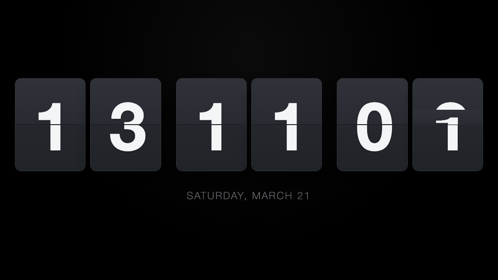
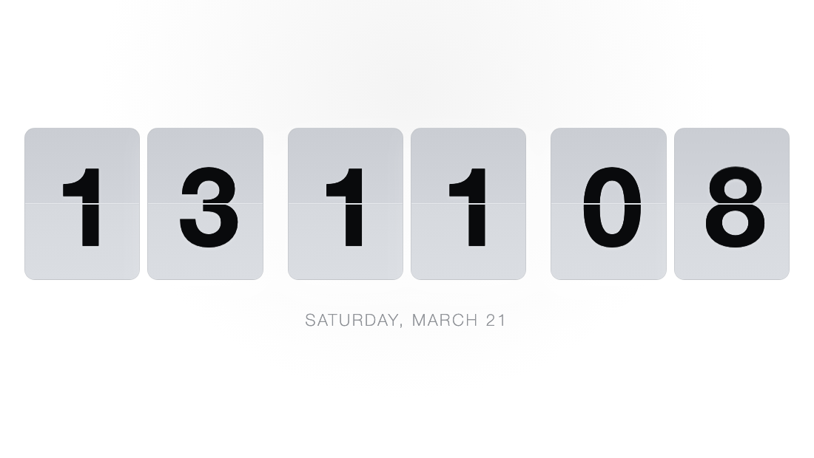

# LSaat

Tam ekran çalışan, mekanik flip saat görünümüne sahip hafif bir web uygulaması.
HTML, CSS ve JavaScript ile geliştirilmiştir.

Repository: https://github.com/LynXMaSTeR/LSaat

## TR

LSaat HTML, CSS ve JavaScript ile hazırlanmış tam ekran mekanik bir saat uygulamasıdır.
Kurulum için projeyi indirip `LSaat.html` dosyasını tarayıcıda açmanız yeterlidir.

### Kısayollar
- `D`: Açık ve koyu tema arasında geçiş
- `F`: Tam ekran modunu aç/kapat
- `G`: Saniyeleri göster/gizle
- `T`: 12/24 saat biçimini değiştir

### Ekran Görüntüleri
#### Animasyonlu Önizleme (GIF)

---

## EN

LSaat is a full-screen mechanical clock built with HTML, CSS, and JavaScript.
To use it, download the project and open `LSaat.html` in your browser.

### Shortcuts
- `D`: Toggle light/dark theme
- `F`: Toggle fullscreen
- `G`: Show/hide seconds
- `T`: Switch between 12-hour and 24-hour formats

### Screenshots
#### Animated Preview (GIF)

